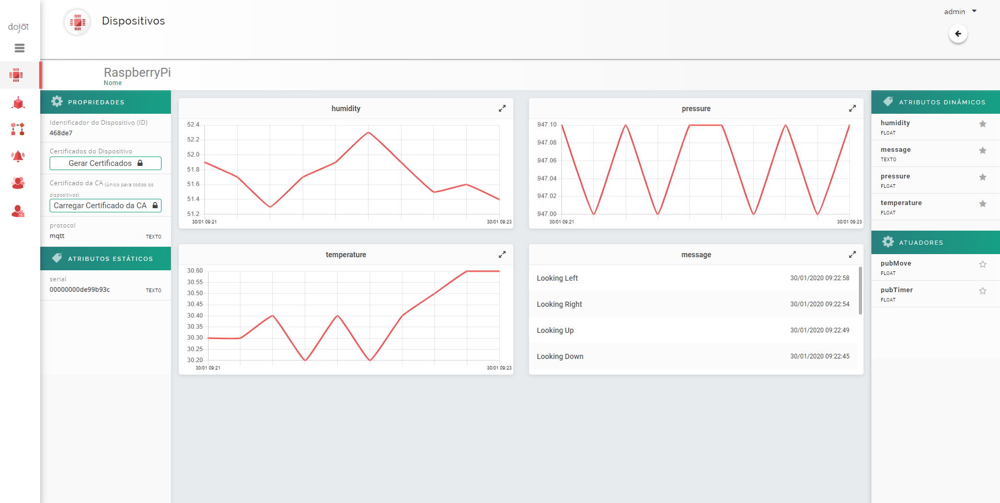
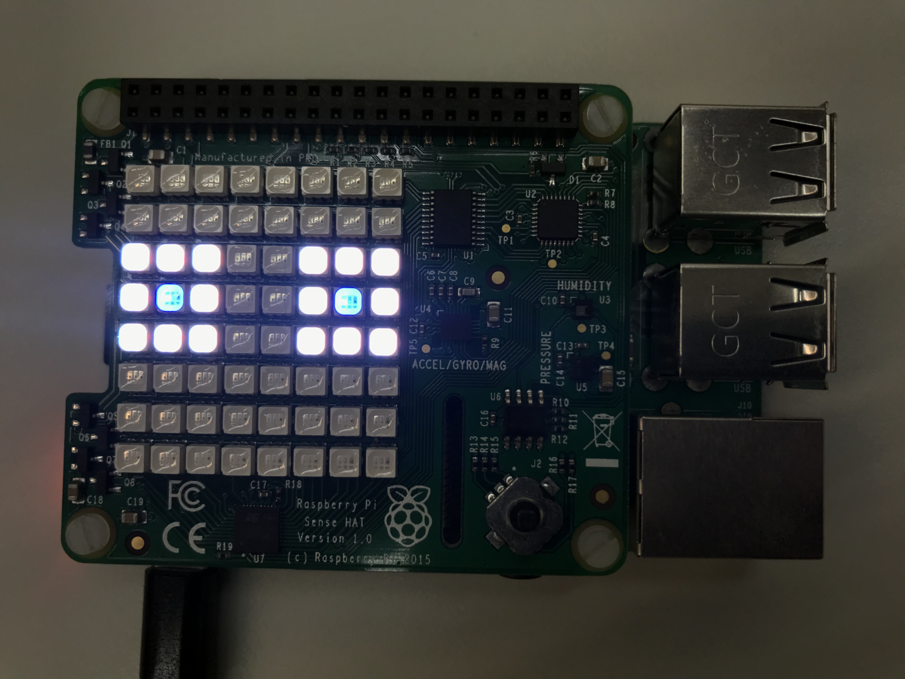
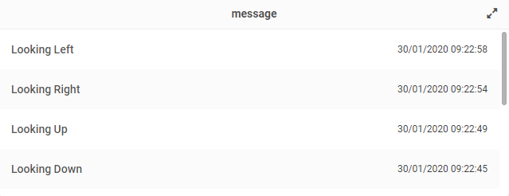
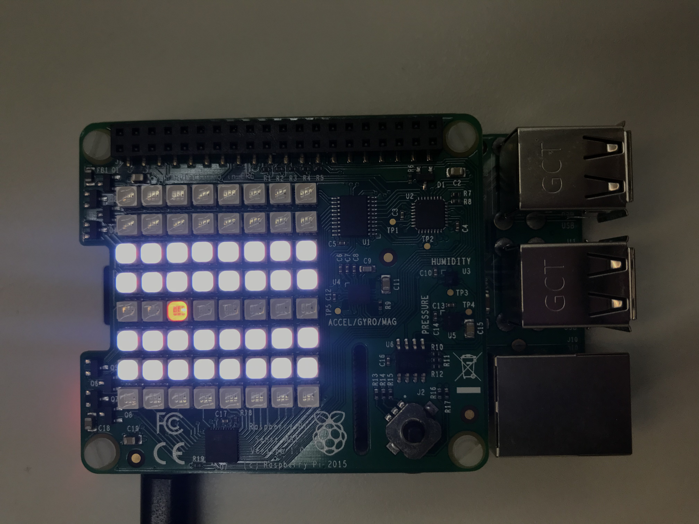
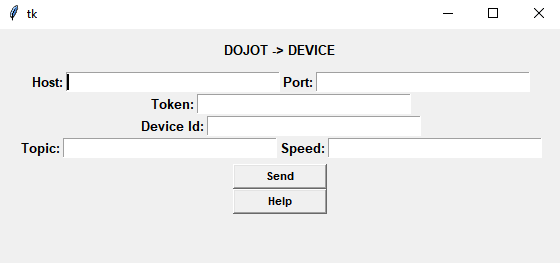

# Raspberry Pi 3 - Sense Hat to Dojot integration
## It's a demo environment using a raspberry pi 3 - sense hat on the Dojot IoT platform

This demo has the purpose to integrate a physical device to Dojot with the MQTT protocol and also to implement a secure connection using TLS.

Its behavior is divided into two applications that are running in parallel:

1° The sensors (temperature, humidity, and pressure) are periodically read and their data are published at a default interval.

2° Through a joystick it's possible to switch between two applications on the device:
- Pressing up: Two eyes are plotted on the LED matrix, using an accelerometer sensor, according to the movement of the device the eyes change position and the movement data are published in real-time on Dojot.
- Pressing down: A conveyor belt will be simulated then a red ball will be passing through the matrix on a default speed.
- Pressing middle: Closes applications.

You'll need:
* [Raspberry Pi 3](https://www.raspberrypi.org/products/raspberry-pi-3-model-b)
* [Sense Hat](https://www.raspberrypi.org/products/sense-hat/)
* [Running instance of dojot platform](http://dojotdocs.readthedocs.io/en/latest/installation-guide.html)

You must configure your device before starting. 

Run the following commands:

```shell
sudo apt-get install sense-hat
pip3 install paho-mqtt
pip3 install requests
git clone https://github.com/MatheusTenorio/private-sensehat.git
cd private-sensehat
```
To execute the code it's necessary to pass some parameters: `Dojot Host`, `Raspberry IP` and `Port`.

- Execute: 

```shell
python3 -m dojotsh.main -H <Dojot Host> -d <Raspberry IP> -P 8883 
```

The `dojotsh.main` script will configure dojot with the template `RaspberryPi-SenseHat` and the device `RaspberryPi`

The data will be available in dojot as illustrated in the image below.



Accelerometer application.





Conveyor belt application.




# GUI
A python graphical interface was also developed using the Tkinter lib, it's used for the dojot actuation on the device, being able to change the publish time of the sensors and the time of the conveyor belt.

To send Dojot data to the device, you need to fill the fields with the correct data. The help button will help to fill them.

## pubTimer
Topic pubTimer -> changes the publish time of the data obtained from the sensors.

## pubMove
Topic pubMove -> changes the speed of the conveyor belt.

The interface is in the image below:



- Execute:

```shell
cd gui
sudo apt-get install python3-tk
sudo apt-get install python3-requests
python3 gui.py
```
